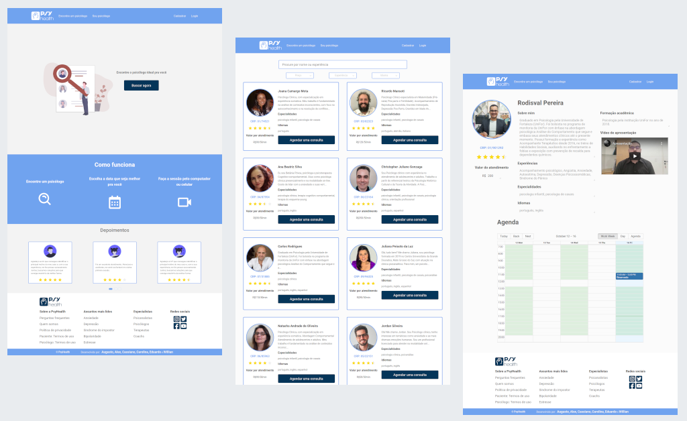

# Psy-health

## Sobre

Este projeto trata-se de um MVP de uma **Plataforma de agendamento de consultas com psicólogos**

<h1 align = center>
    
</h1>

## Acesse a Plataforma - **[Psy Health](https://psy-health.vercel.app/)**

**cadastre um usuário**

ou utilize uma **conta de paciente** : ahncarolina@gmaiol.com - senha: 123456

ou utilize uma **conta de psicólogo** : rodisval.psicologo@gmail.com - senha: 123abc

## Funcionalidades:

Projeto implementado no curso da [Kenzie Academy](https://kenzie.com.br/) em outubro de 2020;

- permite o cadastro de pacientes e psicólogos;
- psicólogo pode editar seu perfil, horários de atendimento e valor da consulta;
- usuário pode visualizar todas as informações do psicólogo e realizar o login apenas para agendar uma consulta;
- usuário tem acesso a sua lista de consultas, podendo cancelar ou reagendar consultas futuras ou avaliar consultas já realizadas;
- próximo ao horário agendado, o usuário tem acesso ao link do Whereby para realizar a consulta.

## Tecnologias:

- JavaScript, Typescript, React, Redux;
- Styled components, React-icons, Antd, Undraw;
- JSON Server;
- react-big-calendar;
- Vercel;
- Jest, Enzyme, Cypress.

## Time (gestão ágil - scrum):

###### [Augusto Pietroski - PO](https://www.linkedin.com/in/augusto-pietroski/)

###### [Carolina Ahn - Scrum Master](https://www.linkedin.com/in/carolina-ahn/)

###### [Cassiano Bitencourt - Tech Lead](https://www.linkedin.com/in/cassiano-doederlein-648592148/)

###### [Eduardo Magno - QA](https://www.linkedin.com/in/edu-magno/)

###### [Alex Miguel - Dev](https://www.linkedin.com/in/alexmiguel95/)

###### [Willian Brusch - Dev](https://www.linkedin.com/in/willian-brusch-237448154/)
